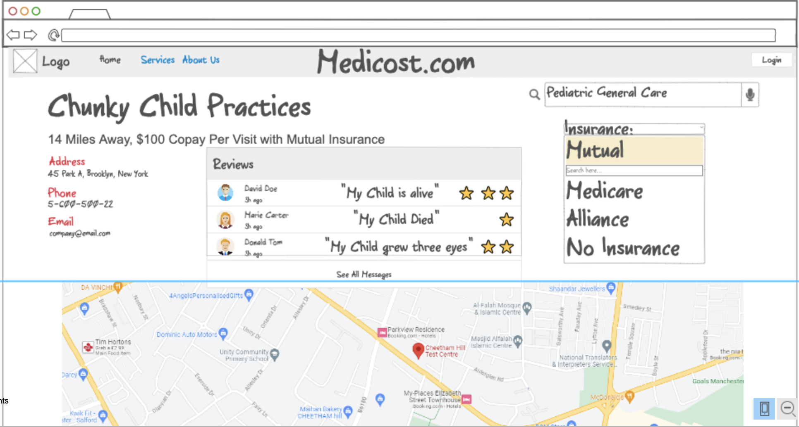

# 260-Startup

# MediCost
Medicost is an application that compares doctors all over a given area (Provo, for example). A user creates an account, chooses their insurance, and then can filter clinics and offices based on their healthcare needs. This will include options for specific procedures, general practice doctors, and ER rates for all known hospitals and clinics. The application will also include a rating system for doctors and clinics according to registered users. The interface would look like a much better version of the following representation:

## Key Features:
- Secure login and account creation 
- Search history is permanently saved in account profile
- User review history is also permanently saved, always viewable by all users
- Ability to set default insurance for searches
- All clinics will have an average rating (not seen in the mock)

## Technologies used:
- **Authentication**: Users must make an account to leave and view reviews. Their favorite doctors and clinics will also be saved. 
- **Database data**: User reviews for each hospital in the database will appear upon selecting that hospital location in a search. 
- **WebSocket data**: The homepage will have links for recent medical news from Google, probably... Or maybe local news based on location! Also, prices for hospitals will ideally be scraped from other sources (insurance websites??)

## HTML deliverable

For this deliverable I built out the structure of my application using HTML.

- **HTML pages** - 8 HTML Pages that form the structure of the website
- **Links** - Several Links, both to local paths and outside sources
- **Text** - Oodles of text in website and hospital descriptions, as well as hospital reviews
- **Images** - At least five images, as well as the tab icon, from local and internet sources
- **Login** - Login and Account Creation pages included
- **Database** - Several database placeholders for user reviews, search history and user favorites
- **WebSocket** - Websocket placeholders for current insurance rates on hospital descriptions and medical news on index.html

## CSS deliverable

For this deliverable I properly styled the application into its final appearance.

- **Header, footer, and main content body** - All formatted into pretty, curvy bubbles!
- **Navigation elements** - optimized using Bootstrap
- **Responsive to window resizing** - Flex is used, along with percentage sizes and viewport height and
width for phone-friendly sizing. Nav element needs work on phones, but bootstrap is confusing.
- **Application elements** - Formatted map to look better, and put in contrasting and colorful text
boxes with a consistent format
- **Application text content** - Brought in google font to make unique vibes
- **Application images** - Profile picture and BYU logo made circular!

## JavaScript deliverable

For this deliverable I implemented by JavaScript so that the application works for a single user. I also added placeholders for future technology.

- **login** - Login saves information to localStorage, along with an uploaded image in the Create Account page. Username displays itself on the profile page.
- **database** - Favorited clinics and recent hospital pages visited shows up on the profile page. There is an option to favorite the clinic on each clinic page in the "Search This Area" feature that saves the favorite to the localStorage
- **WebSocket** - There is a list of online users and doctors at the bottom of index.html that serves as a placeholder for keeping track of actual users on the website. It randomly displays and deletes names from an array in a function at the bottom of index.html.
- **application logic** - Added a function on each clinic page in "Search This Area" to leave a review. I don't know how to put in stars efficiently yet, but I'll keep trying! Only remaining application logic will be to personalize results based on location/price, and to get the map API working, but the basic layout of the website is complete. 

## Service deliverable

For this deliverable I converted the service to fetch API endpoints for login. Now, user information is saved!

- **Node.js/Express HTTP service** - Startup runs and is tested through Node "index.js".
- **Static middleware for frontend** - files served through express for frontend application, located in "public"
- **Calls to third party endpoints** - Calls google maps API on the homepage
- **Backend service endpoints** - Endpoint calls exist for login and fetching user information upon login, as well as storing user information in a backend database placeholder upon user registration.
- **Frontend calls service endpoints** - Frontend calls are all contained in login.js, which handle the above mentioned backend login functions.

## DB deliverable

For this deliverable I stored the votes in the database.

- **MongoDB Atlas database created** - Done!
- **Endpoints for data** - endpoints edited to accomodate data
- **Stores data in MongoDB** - Sure does, peep that COOOODE

## Login deliverable

I got a nice login system working!

- **User registration** - Works! Although the authtoken doesn't send as a cookie until you use the login function. I have no idea why...
- **existing user** - Login works great! try it out after making a user hehehehe
- **Use MongoDB to store credentials** - heck yeah baby, peep those sexy encryptions in database.js
- **Restricts functionality** - Profile and search button don't work till you've logged in (register doesn't automatically log you in yet, sad :()

## WebSocket deliverable

For this deliverable, I display the number of users actively on the website at the bottom of index.js.

- **Backend listens for WebSocket connection** - websocket.js listens on port 3000.
- **Frontend makes WebSocket connection** - index.html javascript at the bottom makes a websocket connection
- **Data sent over WebSocket connection** - Websocket.js sends to frontend the number of active users online
- **WebSocket data displayed** - check out the bottom of the homepage! I intend to make that number only the users that are logged in, but the websocket connection is finished and consistent. Try opening the page in multiple tabs or more than one device!

## React deliverable

For this deliverable I converted the application over to use React!

- **Bundled and transpiled** - All .jsx, html, and css files were transpiled into the classic ugly monsters with Vite.
- **Components** - Every page on the website is now a component, as evidenced by the fact that the homepage does not appear fully until you press "Home" or something else. Oops! Kinda broken, but it looks okay. 
- **Router** - App.jsx routes components to viewport, header and footer stay static
- **Hooks** - Hooks are used to change state on login and authentication (Logout button appears, Profile header link works, and login text disappears upon successful login). I even somehow connected the database! It's a real miracle. 

### Limitations
There's a reason why this hasn't been done on a large scale. It's an idea that has a lot of application across a huge swath of the market (the market being all people that need to go to the hospital). Monetizing this bad boy would be one thing (perhaps impossble), but making an extremely simple and intuitive UI is the highest priority.

