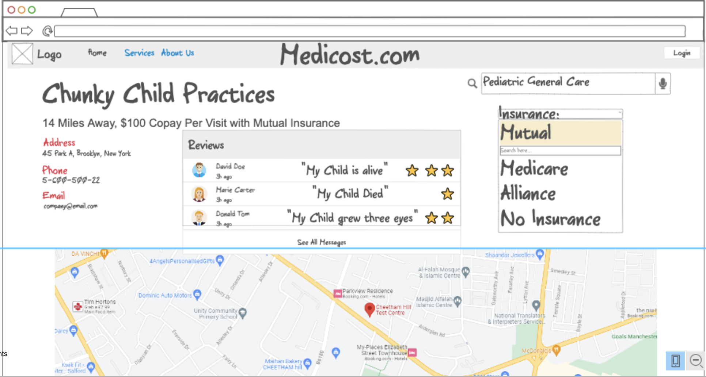

# 260-Startup

# MediCost
Medicost is an application that compares doctors all over a given area (Provo, for example). A user creates an account, chooses their insurance, and then can filter clinics and offices based on their healthcare needs. This will include options for specific procedures, general practice doctors, and ER rates for all known hospitals and clinics. The application will also include a rating system for doctors and clinics according to registered users. The interface would look like a much better version of the following representation:

## Key Features:
- Secure login and account creation 
- Search history is permanently saved in account profile
- User review history is also permanently saved, always viewable by all users
- Ability to set default insurance for searches
- All clinics will have an average rating (not seen in the mock)

## Technologies used:
- **Authentication**: Users must make an account to leave and view reviews. Their favorite doctors and clinics will also be saved. 
- **Database data**: User reviews for each hospital in the database will appear upon selecting that hospital location in a search. 
- **WebSocket data**: The homepage will have links for recent medical news from Google, probably... Or maybe local news based on location! Also, prices for hospitals will ideally be scraped from other sources (insurance websites??)

## HTML deliverable

For this deliverable I built out the structure of my application using HTML.

- **HTML pages** - 8 HTML Pages that form the structure of the website
- **Links** - Several Links, both to local paths and outside sources
- **Text** - Oodles of text in website and hospital descriptions, as well as hospital reviews
- **Images** - At least five images, as well as the tab icon, from local and internet sources
- **Login** - Login and Account Creation pages included
- **Database** - Several database placeholders for user reviews, search history and user favorites
- **WebSocket** - Websocket placeholders for current insurance rates on hospital descriptions and medical news on index.html

## CSS deliverable

For this deliverable I properly styled the application into its final appearance.

- **Header, footer, and main content body** - All formatted into pretty, curvy bubbles!
- **Navigation elements** - optimized using Bootstrap
- **Responsive to window resizing** - Flex is used, along with percentage sizes and viewport height and
width for phone-friendly sizing. Nav element needs work on phones, but bootstrap is confusing.
- **Application elements** - Formatted map to look better, and put in contrasting and colorful text
boxes with a consistent format
- **Application text content** - Brought in google font to make unique vibes
- **Application images** - Profile picture and BYU logo made circular!

## JavaScript deliverable

For this deliverable I implemented by JavaScript so that the application works for a single user. I also added placeholders for future technology.

- **login** - 
- **database** - 
- **WebSocket** - 
- **application logic** - 

## Service deliverable

For this deliverable I added backend endpoints that receives votes and returns the voting totals.

- **Node.js/Express HTTP service** - 
- **Static middleware for frontend** - 
- **Calls to third party endpoints** - 
- **Backend service endpoints** - 
- **Frontend calls service endpoints** - 

## DB deliverable

For this deliverable I stored the votes in the database.

- **MongoDB Atlas database created** - 
- **Endpoints for data** - 
- **Stores data in MongoDB** - 

## Login deliverable

For this deliverable I associate the votes with the logged in user.

- **User registration** - 
- **existing user** - 
- **Use MongoDB to store credentials** - 
- **Restricts functionality** - 

## WebSocket deliverable

For this deliverable I used webSocket to update the votes on the frontend in realtime.

- **Backend listens for WebSocket connection** - 
- **Frontend makes WebSocket connection** - 
- **Data sent over WebSocket connection** - 
- **WebSocket data displayed** - 

## React deliverable

For this deliverable I converted the application over to use Vue. I know it is supposed to use React, but the instructor said I could use Vue because I already have extensive experience with React.

- **Bundled and transpiled** - 
- **Components** - 
- **Router** - 
- **Hooks** - 

### Limitations
There's a reason why this hasn't been done on a large scale. It's an idea that has a lot of application across a huge swath of the market (the market being all people that need to go to the hospital). Monetizing this bad boy would be one thing (perhaps impossble), but making an extremely simple and intuitive UI is the highest priority.

